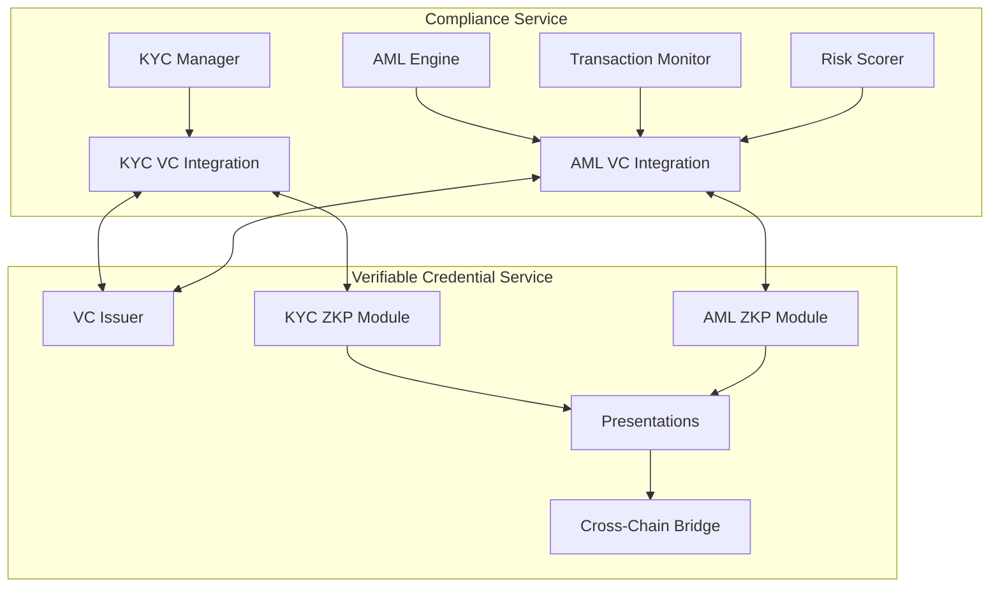

# Compliance Service and Verifiable Credential Service Integration

## Overview

This document describes the enhanced integration between the compliance-service and verifiable-credential-service in PlatformQ. The integration enables privacy-preserving compliance through zero-knowledge proofs while maintaining regulatory requirements.

## Architecture

### Integration Points



## Key Features

### 1. KYC Verifiable Credentials

The integration provides privacy-preserving KYC verification through:

- **Multi-tier KYC Credentials**: Support for Tier 1, 2, and 3 KYC levels
- **Zero-Knowledge Proofs**: Prove KYC status without revealing personal data
- **Selective Disclosure**: Share only required attributes
- **Time-bounded Validity**: Automatic expiration and renewal

#### KYC Attributes Available for ZKP:
- `age_over_18` / `age_over_21`
- `identity_verified`
- `address_verified`
- `country_not_sanctioned`
- `source_of_funds_verified`
- `accredited_investor`
- `institutional_verified`
- `kyc_level`

### 2. AML Verifiable Credentials

Enhanced AML compliance through verifiable credentials:

- **Risk Assessment Credentials**: Portable risk scores and assessments
- **Sanctions Check Credentials**: Time-bounded sanctions clearance
- **Transaction Monitoring Credentials**: Compliance summaries
- **Blockchain Analytics Credentials**: Address risk analysis

#### AML Attributes Available for ZKP:
- `risk_score_below_threshold`
- `not_sanctioned`
- `risk_level_acceptable`
- `transaction_volume_compliant`
- `no_high_risk_countries`
- `blockchain_analytics_clean`
- `monitoring_compliant`
- `last_check_recent`

### 3. Integration Services

#### KYC VC Integration Service (`kyc_vc_integration.py`)
- Issues KYC verifiable credentials after verification
- Generates ZK proofs for KYC status
- Creates document verification credentials
- Manages KYC presentations

#### AML VC Integration Service (`aml_vc_integration.py`)
- Issues AML risk assessment credentials
- Creates sanctions check credentials
- Generates blockchain analytics credentials
- Manages AML compliance presentations

## API Endpoints

### Compliance Service New Endpoints

```
# KYC VC Integration
POST /api/v1/kyc/{user_id}/issue-credential
POST /api/v1/kyc/{user_id}/generate-proof
POST /api/v1/kyc/verify-proof
POST /api/v1/kyc/{user_id}/create-presentation

# AML VC Integration  
POST /api/v1/aml/{user_id}/issue-risk-credential
POST /api/v1/aml/{entity_id}/issue-sanctions-credential
POST /api/v1/aml/{address}/issue-analytics-credential
POST /api/v1/aml/{user_id}/create-compliance-proof
```

### Verifiable Credential Service New Endpoints

```
# AML ZKP Operations
POST /api/v1/credentials/aml/create
POST /api/v1/zkp/aml/generate-proof
POST /api/v1/zkp/aml/verify-proof
POST /api/v1/compliance/aml/check
GET  /api/v1/zkp/aml/templates
POST /api/v1/zkp/aml/batch-verify
```

## Implementation Guide

### Step 1: Enable VC Integration in Compliance Service

```python
# In compliance service initialization
from app.services import VCIntegrationService, AMLVCIntegrationService

# Initialize VC integration
vc_integration = VCIntegrationService(
    vc_service_url="http://verifiable-credential-service:8000",
    kyc_manager=kyc_manager,
    issuer_did="did:platform:compliance-service"
)

aml_vc_integration = AMLVCIntegrationService(
    vc_service_url="http://verifiable-credential-service:8000",
    aml_engine=aml_engine,
    issuer_did="did:platform:compliance-service"
)
```

### Step 2: Issue Credentials After Compliance Checks

```python
# After KYC verification
if kyc_status == KYCStatus.APPROVED:
    credential = await vc_integration.issue_kyc_credential(
        verification=kyc_verification,
        user_did=f"did:platform:{user_id}"
    )
    
# After AML risk assessment
risk_credential = await aml_vc_integration.issue_aml_risk_credential(
    user_did=f"did:platform:{user_id}",
    risk_assessment=assessment
)
```

### Step 3: Generate Zero-Knowledge Proofs

```python
# Generate KYC proof
kyc_proof = await vc_integration.generate_kyc_proof(
    credential_id=credential_id,
    holder_did=user_did,
    attributes_to_prove=["age_over_18", "identity_verified"],
    min_kyc_level=2
)

# Generate AML compliance proof
aml_proof = await aml_vc_integration.create_aml_zkp_proof(
    credential_id=risk_credential_id,
    holder_did=user_did,
    attributes_to_prove=["risk_score_below_threshold", "not_sanctioned"]
)
```

### Step 4: Verify Proofs Without Revealing Data

```python
# Verify KYC proof
verification_result = await vc_integration.verify_kyc_proof(
    proof_id=proof_id,
    required_attributes=["age_over_18", "kyc_level"],
    min_kyc_level=2
)

# Verify AML proof
aml_result = await aml_vc_integration.verify_aml_compliance_proof(
    proof_id=aml_proof_id,
    required_checks=["risk_score_below_threshold"],
    max_risk_score=0.7
)
```

## Use Cases

### 1. Privacy-Preserving KYC Verification

**Scenario**: A DeFi protocol needs to verify users are KYC-compliant without accessing personal data.

```python
# User generates proof
proof = await generate_kyc_proof(
    attributes_to_prove=["age_over_18", "identity_verified", "country_not_sanctioned"],
    min_kyc_level=2
)

# DeFi protocol verifies
if verify_proof(proof):
    allow_trading()
```

### 2. Cross-Platform AML Compliance

**Scenario**: User proves AML compliance across multiple platforms without repeated checks.

```python
# Create AML compliance presentation
presentation = await create_aml_compliance_presentation(
    credential_ids=[risk_cred_id, sanctions_cred_id, monitoring_cred_id],
    purpose="defi_trading",
    validity_minutes=30
)

# Any platform can verify
if verify_presentation(presentation):
    grant_access()
```

### 3. Regulatory Reporting with Privacy

**Scenario**: Generate regulatory reports while preserving user privacy.

```python
# Aggregate compliance proofs
compliance_proofs = await batch_verify_aml_proofs(
    proof_ids=user_proof_ids,
    constraints={"max_risk_score": 0.5}
)

# Generate report with statistics only
report = generate_compliance_report(
    total_users=len(compliance_proofs),
    compliant_users=compliance_proofs.valid_count,
    risk_distribution=aggregate_risk_levels(compliance_proofs)
)
```

## Security Considerations

### 1. Credential Security
- Store credentials encrypted at rest
- Use hardware security modules for signing
- Implement credential revocation registry
- Regular credential rotation

### 2. Zero-Knowledge Proof Security
- Use proven ZKP libraries (arkworks, bellman)
- Implement proper random number generation
- Validate all proof parameters
- Time-bound all proofs

### 3. Integration Security
- Mutual TLS between services
- API authentication and rate limiting
- Audit logging for all operations
- Regular security assessments

## Performance Optimization

### 1. Caching Strategy
```python
# Cache frequently used proofs
@cache(ttl=3600)
async def get_kyc_proof(user_id: str, attributes: List[str]):
    return await generate_kyc_proof(...)
```

### 2. Batch Operations
```python
# Batch credential issuance
credentials = await batch_issue_credentials(
    user_credentials=[
        (user1_id, kyc_data1),
        (user2_id, kyc_data2),
        ...
    ]
)
```

### 3. Parallel Processing
```python
# Parallel proof generation
proofs = await asyncio.gather(
    generate_kyc_proof(...),
    generate_aml_proof(...),
    generate_monitoring_proof(...)
)
```

## Migration Guide

### For Existing Compliance Service Users

1. **Update Dependencies**
   ```bash
   pip install httpx pydantic
   ```

2. **Initialize VC Integration**
   ```python
   # Add to service initialization
   app.state.vc_integration = VCIntegrationService(...)
   app.state.aml_vc_integration = AMLVCIntegrationService(...)
   ```

3. **Update KYC/AML Workflows**
   - Add credential issuance after verification
   - Replace direct data sharing with ZKP generation
   - Update verification to use proofs

### For Existing VC Service Users

1. **Import New Modules**
   ```python
   from app.zkp import AMLZeroKnowledgeProof, AMLAttribute
   from app.api import aml_zkp
   ```

2. **Register New Routes**
   ```python
   app.include_router(aml_zkp.router, prefix="/api/v1", tags=["aml-zkp"])
   ```

3. **Configure AML Templates**
   - Review and customize proof templates
   - Set appropriate constraints
   - Configure validity periods

## Monitoring and Analytics

### Key Metrics to Track

1. **Credential Metrics**
   - Credentials issued per day
   - Credential types distribution
   - Average credential lifetime
   - Revocation rate

2. **ZKP Metrics**
   - Proofs generated per hour
   - Proof verification success rate
   - Average proof generation time
   - Most requested attributes

3. **Compliance Metrics**
   - KYC verification completion rate
   - AML compliance check frequency
   - Risk score distribution
   - Sanctions hit rate

### Example Monitoring Dashboard

```python
# Prometheus metrics
credential_issued_total = Counter(
    'vc_credentials_issued_total',
    'Total credentials issued',
    ['credential_type', 'issuer']
)

zkp_generation_duration = Histogram(
    'zkp_generation_duration_seconds',
    'ZKP generation duration',
    ['proof_type']
)

compliance_checks_total = Counter(
    'compliance_checks_total',
    'Total compliance checks',
    ['check_type', 'result']
)
```

## Future Enhancements

### 1. Advanced Privacy Features
- Implement threshold signatures for distributed trust
- Add homomorphic encryption for computations on encrypted data
- Support for delegated proofs and proxy re-encryption

### 2. Cross-Chain Compliance
- Bridge compliance credentials to multiple blockchains
- Support for cross-chain proof verification
- Interoperability with other compliance systems

### 3. AI-Enhanced Compliance
- Machine learning for risk pattern detection
- Automated compliance policy updates
- Predictive compliance analytics

## Conclusion

The integration between compliance-service and verifiable-credential-service provides a powerful framework for privacy-preserving regulatory compliance. By leveraging zero-knowledge proofs and verifiable credentials, PlatformQ enables users to prove compliance without revealing sensitive personal or financial information, while maintaining full regulatory adherence. 