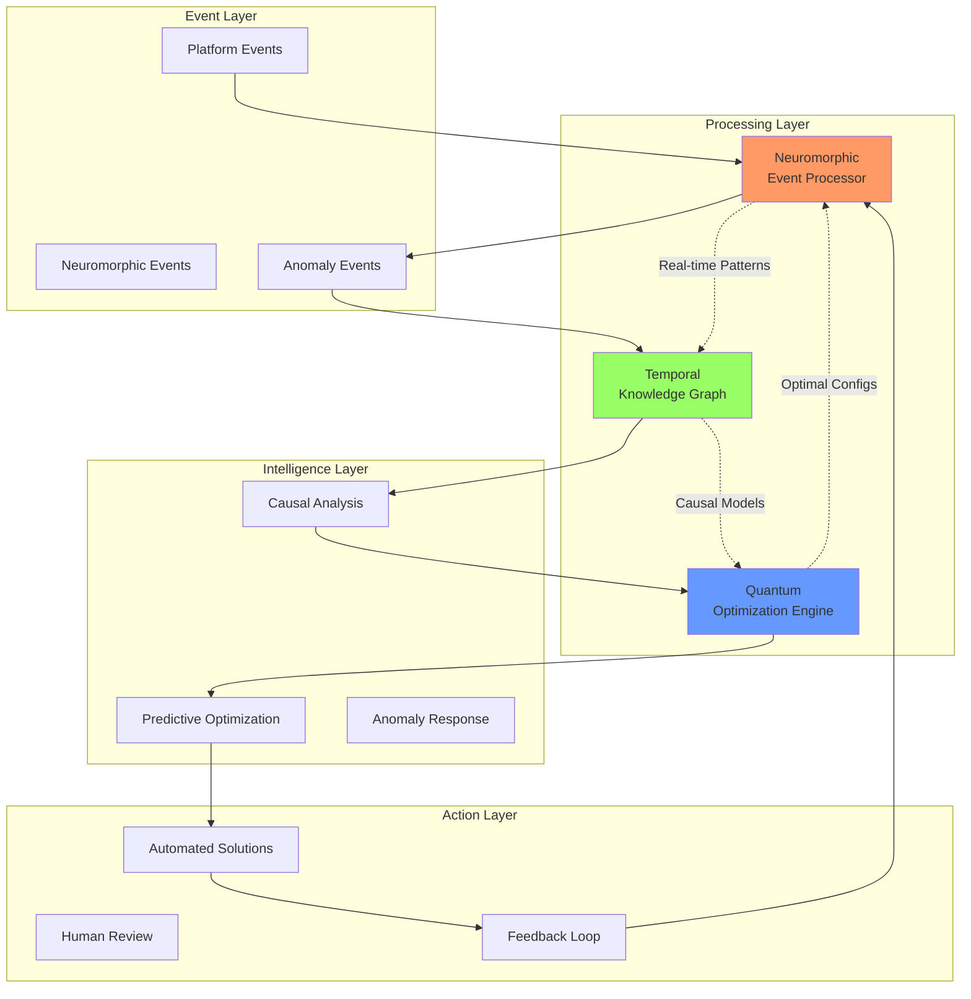

# Advanced Capabilities Integration Guide

This guide demonstrates how the three cutting-edge capabilities integrate with PlatformQ's existing architecture and with each other.

## Overview of New Capabilities

1. **Neuromorphic Event Processing**: Microsecond anomaly detection using spiking neural networks
2. **Temporal Knowledge Graph**: Time-aware reasoning with causal inference for what-if analysis  
3. **Quantum Optimization Engine**: Quantum-inspired algorithms for complex optimization problems

## Integration Architecture



## Synergistic Use Cases

### 1. Predictive System Optimization

**Scenario**: Prevent cascading failures through real-time optimization

```python
class PredictiveSystemOptimizer:
    def __init__(self):
        self.neuromorphic = NeuromorphicService()
        self.temporal_kg = TemporalKnowledgeGraph()
        self.quantum_opt = QuantumOptimizationEngine()
        
    async def prevent_cascade_failure(self, anomaly_event: Dict):
        """
        Detect → Analyze → Optimize → Prevent
        """
        # 1. Neuromorphic detection identifies anomaly
        if anomaly_event['severity'] > 0.7:
            
            # 2. Temporal KG predicts cascade effects
            cascade_prediction = await self.temporal_kg.simulate_failure(
                component_id=anomaly_event['affected_component'],
                failure_time=datetime.utcnow() + timedelta(minutes=5)
            )
            
            # 3. Quantum optimization finds optimal mitigation
            mitigation_plan = await self.quantum_opt.optimize(
                problem_type="resource_reallocation",
                constraints={
                    "affected_components": cascade_prediction['affected_components'],
                    "available_resources": self.get_available_resources(),
                    "time_limit": 300  # 5 minutes
                }
            )
            
            # 4. Execute mitigation
            await self.execute_mitigation(mitigation_plan)
```

### 2. Intelligent Supply Chain Management

**Scenario**: Real-time route optimization based on anomaly detection

```python
class IntelligentSupplyChain:
    async def optimize_delivery_routes(self):
        """
        Monitor → Detect → Reoptimize
        """
        # Neuromorphic monitoring of IoT sensors
        sensor_stream = await self.neuromorphic.monitor_sensors([
            "vehicle_telemetry",
            "weather_stations", 
            "traffic_sensors"
        ])
        
        async for anomaly in sensor_stream:
            if anomaly['type'] == "route_disruption":
                # Get causal impact analysis
                impact = await self.temporal_kg.analyze_impact(
                    disruption=anomaly,
                    supply_chain_graph=self.get_supply_chain()
                )
                
                # Quantum route reoptimization
                new_routes = await self.quantum_opt.optimize_routes(
                    current_routes=self.active_routes,
                    disruptions=impact['affected_routes'],
                    constraints=impact['time_windows']
                )
                
                await self.update_routes(new_routes)
```

### 3. Adaptive Resource Allocation

**Scenario**: Dynamic cloud resource allocation based on predictive analysis

```python
class AdaptiveResourceManager:
    async def manage_resources(self):
        """
        Continuous optimization loop
        """
        while True:
            # Get current system state
            system_state = await self.get_system_state()
            
            # Neuromorphic pattern detection
            patterns = await self.neuromorphic.detect_patterns(
                system_state,
                pattern_types=["usage_spike", "performance_degradation"]
            )
            
            # Temporal prediction of future needs
            future_demand = await self.temporal_kg.predict_demand(
                current_patterns=patterns,
                horizon=timedelta(hours=1)
            )
            
            # Quantum optimization for allocation
            optimal_allocation = await self.quantum_opt.optimize_allocation(
                current_allocation=system_state['resources'],
                predicted_demand=future_demand,
                cost_constraints=self.budget_constraints
            )
            
            # Apply allocation changes
            await self.apply_allocation(optimal_allocation)
            
            await asyncio.sleep(60)  # Check every minute
```

## Cross-Service Communication

### Event Flow

```yaml
# Neuromorphic → Temporal KG
event: AnomalyDetected
payload:
  anomaly_id: "anom_123"
  component: "auth-service"
  spike_pattern: [0.1, 0.8, 0.9, 0.2]
  severity: 0.85
  
# Temporal KG → Quantum Optimization  
event: CausalChainIdentified
payload:
  root_cause: "database_overload"
  affected_services: ["auth", "user", "session"]
  predicted_impact_time: "2024-01-20T10:30:00Z"
  optimization_needed: true
  
# Quantum Optimization → Action
event: OptimizationComplete
payload:
  solution: 
    type: "resource_reallocation"
    moves: 
      - from: "node-1"
        to: "node-3"
        resource: "cpu"
        amount: 4
  expected_improvement: 0.92
```

### Shared Data Structures

```python
# Common anomaly format
@dataclass
class IntegratedAnomaly:
    # From Neuromorphic
    spike_pattern: np.ndarray
    detection_confidence: float
    
    # From Temporal KG
    causal_chain: List[str]
    predicted_impact: Dict[str, float]
    
    # For Quantum Optimization
    optimization_constraints: Dict
    objective_function: Callable

# Optimization request format
@dataclass 
class OptimizationRequest:
    problem_type: str
    current_state: Dict
    constraints: Dict
    temporal_context: TemporalContext
    neuromorphic_features: List[float]
```

## Deployment Configuration

### Kubernetes Integration

```yaml
apiVersion: v1
kind: ConfigMap
metadata:
  name: advanced-capabilities-config
data:
  integration.yaml: |
    neuromorphic:
      pulsar_topics:
        - platform-events
        - sensor-data
      anomaly_threshold: 0.7
      
    temporal_kg:
      janusgraph_url: "ws://janusgraph:8182"
      causal_confidence: 0.8
      
    quantum_opt:
      backend: "qiskit_aer"
      gpu_enabled: true
      
    integration:
      cascade_prevention_enabled: true
      predictive_optimization: true
      feedback_loop_interval: 300
```

### Service Mesh Configuration

```yaml
apiVersion: networking.istio.io/v1beta1
kind: VirtualService
metadata:
  name: advanced-capabilities-routing
spec:
  hosts:
  - neuromorphic-service
  - temporal-kg-service
  - quantum-opt-service
  http:
  - match:
    - headers:
        priority:
          exact: "critical"
    route:
    - destination:
        host: neuromorphic-service
        subset: gpu-enabled
      weight: 100
    timeout: 1s  # Microsecond processing
```

## Performance Optimization

### 1. Pipeline Optimization

```python
class OptimizedPipeline:
    def __init__(self):
        # Pre-allocate resources
        self.neuromorphic_pool = NeuromorphicPool(size=10)
        self.quantum_circuit_cache = CircuitCache(max_size=1000)
        self.temporal_index_cache = TemporalCache(ttl=3600)
        
    async def process_event_optimized(self, event):
        # Parallel processing where possible
        spike_future = self.neuromorphic_pool.process_async(event)
        temporal_future = self.temporal_index_cache.get_context_async(event)
        
        spike_result, temporal_context = await asyncio.gather(
            spike_future, temporal_future
        )
        
        # Use cached quantum circuits
        optimization = await self.quantum_circuit_cache.optimize(
            problem=self.formulate_problem(spike_result, temporal_context)
        )
        
        return optimization
```

### 2. GPU Acceleration Strategy

```python
# Neuromorphic: GPU for spike propagation
neuromorphic_config = {
    "device": "cuda:0",
    "batch_size": 10000,
    "precision": "float16"
}

# Quantum: GPU for state vector simulation  
quantum_config = {
    "backend": "lightning.gpu",
    "num_gpus": 2,
    "distributed": True
}

# Temporal KG: GPU for graph algorithms
temporal_config = {
    "graph_algorithms": {
        "pagerank": "cugraph",
        "community_detection": "rapids"
    }
}
```

## Monitoring & Observability

### Unified Metrics Dashboard

```python
# Prometheus metrics for cross-service monitoring
advanced_capabilities_metrics = {
    # End-to-end latency
    "e2e_anomaly_to_optimization_seconds": Histogram,
    
    # Cross-service effectiveness
    "cascade_failures_prevented_total": Counter,
    "optimization_quality_score": Gauge,
    
    # Resource utilization
    "neuromorphic_gpu_utilization": Gauge,
    "quantum_circuit_depth": Histogram,
    "temporal_graph_size_nodes": Gauge
}
```

### Distributed Tracing

```yaml
# Jaeger tracing configuration
tracing:
  service_name: "advanced-capabilities"
  spans:
    - name: "anomaly_detection"
      service: "neuromorphic"
    - name: "causal_analysis" 
      service: "temporal-kg"
    - name: "optimization"
      service: "quantum-opt"
  propagation: "w3c"
```

## Best Practices

### 1. Error Handling

```python
class ResilientIntegration:
    async def process_with_fallback(self, event):
        try:
            # Try neuromorphic detection
            anomaly = await self.neuromorphic.detect(event)
        except NeuromorphicOverloadError:
            # Fallback to classical detection
            anomaly = await self.classical_detector.detect(event)
            
        try:
            # Try quantum optimization
            solution = await self.quantum_opt.optimize(anomaly)
        except QuantumSimulatorError:
            # Fallback to classical optimization
            solution = await self.classical_optimizer.optimize(anomaly)
            
        return solution
```

### 2. Testing Strategy

```python
# Integration tests
class TestAdvancedCapabilities:
    async def test_cascade_prevention(self):
        # Inject synthetic anomaly
        anomaly = self.generate_test_anomaly()
        
        # Verify full pipeline
        result = await self.pipeline.process(anomaly)
        
        assert result.cascade_prevented == True
        assert result.optimization_time < 5.0  # seconds
        assert result.accuracy > 0.95
```

## Future Roadmap

1. **Phase 1** (Current): Independent services with basic integration
2. **Phase 2**: Tight coupling with shared memory for microsecond handoffs
3. **Phase 3**: Hardware acceleration (neuromorphic chips, quantum processors)
4. **Phase 4**: Edge deployment with federated learning

## Conclusion

The integration of Neuromorphic Event Processing, Temporal Knowledge Graphs, and Quantum Optimization creates a powerful triumvirate that enables PlatformQ to:

- Detect anomalies in microseconds
- Understand causal relationships and predict cascading effects
- Find optimal solutions to complex problems in real-time
- Create self-healing, self-optimizing systems

This positions PlatformQ at the forefront of intelligent, autonomous platform capabilities. 