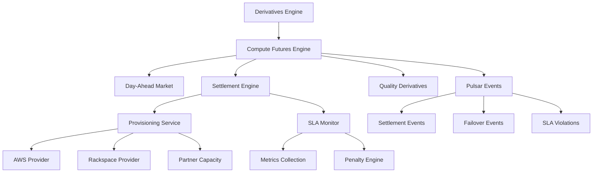

# Compute Futures Physical Settlement System

## Overview

The Compute Futures Physical Settlement System enables trading of compute resources as standardized futures contracts with physical delivery, similar to electricity markets. This system provides price discovery, risk management, and guaranteed resource allocation for compute capacity.

## Key Components

### 1. Day-Ahead Market (DAM)

The day-ahead market operates similarly to electricity DAMs, clearing 24 hourly auctions for next-day compute delivery.

**Features:**
- **Hourly Bidding**: Submit bids for specific hours with price limits
- **Flexible Scheduling**: Bids can shift ±2 hours for better pricing
- **Merit Order Dispatch**: Matches lowest-cost providers with highest-value demand
- **Congestion Management**: Identifies capacity constraints by zone

**Example Flow:**
```python
# Submit bid for GPU resources
bid = {
    "hour": 14,  # 2 PM
    "resource_type": "gpu",
    "quantity": "10",
    "max_price": "100",
    "flexible": True
}
```

### 2. Physical Settlement Engine

Automated provisioning and delivery of compute resources when futures contracts expire.

**Settlement Process:**
1. **Contract Expiry**: System identifies contracts ready for physical delivery
2. **Provider Selection**: Matches buyer with qualified provider
3. **Automated Provisioning**: Triggers resource allocation via provisioning service
4. **Access Delivery**: Provides API endpoints, credentials, and monitoring URLs
5. **SLA Monitoring**: Continuous monitoring for compliance

**Failover Mechanism:**
```python
# Automatic failover chain
Primary Provider → Failover Provider 1 → Failover Provider 2 → Platform Backfill
```

### 3. Provisioning Service Integration

The provisioning service handles the actual resource allocation across multiple providers.

**Supported Providers:**
- **AWS**: EC2, EKS clusters, GPU instances
- **Rackspace**: Bare metal servers
- **Azure**: Virtual machines, container instances
- **On-Premise**: Private cloud, edge locations
- **Partner Networks**: Wholesale capacity from partners

**Resource Types:**
- CPU cores
- GPU units (NVIDIA A100, V100, etc.)
- TPU pods
- Memory allocation
- Storage volumes
- Network bandwidth

### 4. SLA Monitoring & Enforcement

Continuous monitoring ensures quality of service with automatic penalty application.

**Monitored Metrics:**
- **Uptime**: Target 99.9%
- **Latency**: Network round-trip time
- **Performance**: Compute benchmarks vs. advertised specs
- **Availability**: Resource accessibility

**Penalty Structure:**
```
Uptime < 99.9%: 5% penalty per incident
Latency > SLA: 10% penalty per violation
Performance < 95%: 15% penalty per hour
```

### 5. Quality Derivatives

Financial instruments for hedging compute quality risks.

#### Latency Futures
Hedge against network performance degradation between regions.

```python
contract = {
    "region_pair": ("us-east-1", "eu-west-1"),
    "strike_latency_ms": 50,
    "notional": 10000,
    "expiry_days": 30
}
# Pays out if average latency > strike
```

#### Uptime Swaps
Exchange fixed uptime rate for actual uptime performance.

```python
swap = {
    "service_id": "gpu-cluster-01",
    "fixed_uptime_rate": 0.999,  # 99.9%
    "notional_per_hour": 100,
    "duration_days": 30
}
# Fixed payer receives if uptime < 99.9%
```

#### Performance Bonds
Provider posts bond guaranteeing hardware performance.

```python
bond = {
    "hardware_spec": {"gpu_model": "nvidia-a100"},
    "guaranteed_performance": 0.95,  # 95% of theoretical max
    "bond_amount": 50000,
    "expiry_days": 90
}
# Bond forfeited if performance < guaranteed
```

## Market Mechanisms

### 1. Capacity Auctions

Long-term capacity procurement (3-year forward) using Variable Resource Requirement (VRR) curves.

**VRR Curve Design:**
- Target capacity: Forecasted peak + 15% reserve
- Price cap: $150/MW at 80% of target
- Price floor: $0/MW at 120% of target

### 2. Ancillary Services

Additional services for grid stability:

- **Latency Regulation**: Sub-100ms response for real-time balancing
- **Burst Capacity**: Quick-start resources for demand spikes
- **Failover Reserve**: Standby capacity for reliability

### 3. Real-Time Imbalance Market

Balances actual vs. scheduled usage with premium/discount pricing:

- **Shortage**: Real-time price = Day-ahead × 1.5
- **Surplus**: Real-time price = Day-ahead × 0.7

## Integration Architecture



## Event Flow

### Settlement Initiation
```json
{
    "event": "compute.futures.settlement.initiated",
    "settlement_id": "CS_123",
    "contract_id": "CF_GPU_202401",
    "buyer_id": "buyer_123",
    "provider_id": "provider_aws",
    "resource_type": "gpu",
    "quantity": "10",
    "delivery_start": "2024-01-15T10:00:00Z",
    "duration_hours": 24
}
```

### Provisioning Success
```json
{
    "event": "compute.futures.provisioned",
    "settlement_id": "CS_123",
    "allocation_id": "alloc_456",
    "provider": "aws",
    "access_details": {
        "api_endpoint": "https://compute-123.aws.com",
        "credentials": "encrypted_creds"
    }
}
```

### SLA Violation
```json
{
    "event": "compute.futures.sla.violation",
    "settlement_id": "CS_123",
    "violation_type": "uptime",
    "expected": "99.9",
    "actual": "98.5",
    "penalty_amount": "500"
}
```

## API Endpoints

### Day-Ahead Market
- `POST /api/v1/compute-futures/day-ahead/submit-bid` - Submit hourly bid
- `GET /api/v1/compute-futures/day-ahead/market-clearing` - Get clearing results

### Physical Settlement
- `POST /api/v1/compute-futures/settlement/initiate` - Start settlement
- `GET /api/v1/compute-futures/settlement/{id}/status` - Check status

### Quality Derivatives
- `POST /api/v1/compute-futures/quality/latency-future` - Create latency hedge
- `POST /api/v1/compute-futures/quality/uptime-swap` - Create uptime swap
- `POST /api/v1/compute-futures/quality/performance-bond` - Issue performance bond

### Monitoring
- `GET /api/v1/metrics/compute/{settlement_id}` - Get SLA metrics
- `GET /api/v1/compute-futures/real-time/imbalance-price` - Current imbalance

## Configuration

### Settlement Configuration
```yaml
settlement:
  sla_requirements:
    min_uptime_percent: 99.9
    max_latency_ms: 50
    min_performance_score: 0.95
    penalty_rate: 0.1  # 10% per 1% breach
  
  failover:
    max_attempts: 3
    timeout_seconds: 300
    priority_providers:
      - provider_aws: 10
      - provider_rackspace: 20
      - provider_azure: 30
```

### Market Configuration
```yaml
day_ahead_market:
  gate_closure_hours: 12  # Hours before delivery
  min_bid_size: 1
  max_bid_size: 1000
  tick_size: 0.01
  
capacity_auction:
  delivery_years: [2025, 2026, 2027]
  reserve_margin: 0.15  # 15%
  price_cap: 150
  price_floor: 0
```

## Security Considerations

1. **Access Control**: Provisioned resources use temporary credentials with least privilege
2. **Network Isolation**: Each settlement gets isolated network segments
3. **Encryption**: All API communications use TLS 1.3
4. **Audit Trail**: Complete logging of all settlement activities
5. **Multi-Factor Authentication**: Required for high-value settlements

## Monitoring & Observability

### Key Metrics
- Settlement success rate
- Average provisioning time
- SLA compliance percentage
- Failover frequency
- Market liquidity (bid/ask spread)

### Dashboards
- Real-time settlement status
- Provider performance rankings
- Market depth visualization
- Quality derivative positions
- P&L tracking

## Future Enhancements

1. **Cross-Region Arbitrage**: Automated trading between regional markets
2. **Carbon-Aware Scheduling**: Prefer green energy compute providers
3. **Quantum Resource Markets**: Futures for quantum computing time
4. **Federated Learning Markets**: Distributed AI training capacity
5. **Edge Computing Futures**: Millisecond-latency edge resources 