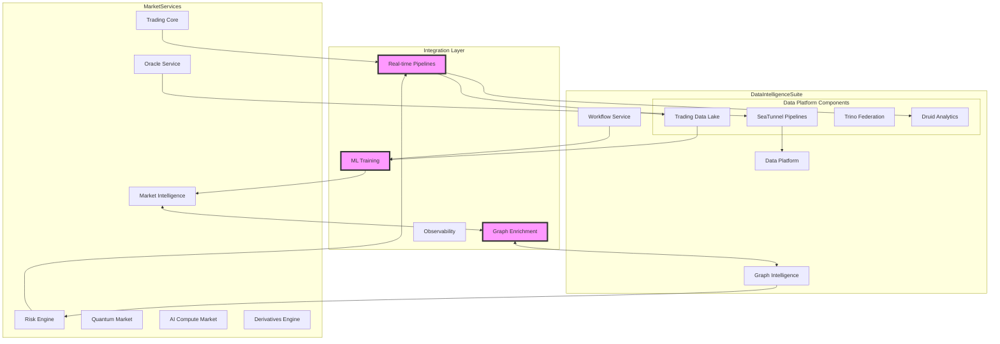

# Deep Integration Architecture: DataIntelligenceSuite & MarketServices

## Overview

This document outlines the comprehensive integration between DataIntelligenceSuite and MarketServices, creating a unified, intelligent trading and data platform that leverages advanced analytics, machine learning, and real-time processing capabilities.

## Integration Architecture



## Key Integration Components

### 1. Real-time Trading Data Pipeline

The `TradingRealtimePipeline` provides seamless data flow from MarketServices to DataIntelligenceSuite:

#### Features:
- **Order Flow Analysis**: Real-time ingestion and enrichment of order data
- **Market Data Aggregation**: 1-minute aggregations with technical indicators
- **Risk Metrics Streaming**: Real-time VaR, leverage, and concentration calculations
- **ML Feature Generation**: Automated feature engineering for predictive models

#### Data Flow:
```
Trading Core → Pulsar → SeaTunnel → Enrichment → Data Lake/Ignite/Druid
```

#### Key Pipelines:

1. **Order Flow Pipeline**
   - Sources: `trading.orders.*` topics
   - Enrichment: Market sentiment, volatility regime, liquidity scores
   - Sink: Ignite cache for real-time access

2. **Market Data Pipeline**
   - Sources: Trades and orderbook data
   - Transformations: VWAP, technical indicators (RSI, MACD, Bollinger Bands)
   - Sinks: Druid (time-series) + Elasticsearch (search)

3. **Risk Metrics Pipeline**
   - Source: Ignite positions cache
   - Calculations: Portfolio volatility, VaR, concentration risk
   - Alerts: Automatic triggering on threshold breaches

4. **ML Features Pipeline**
   - Sources: Unified data from all pipelines
   - Features: Order imbalance, price momentum, trader skill metrics
   - Sink: Iceberg tables for ML training

### 2. Graph Intelligence Integration

The `GraphDataIntegration` enhances market predictions with relationship-based insights:

#### Capabilities:

1. **Trader Network Analysis**
   - Influence scoring using PageRank
   - Copy trading cascade risk assessment
   - Trading clique detection
   - Network sentiment aggregation

2. **Market Manipulation Detection**
   - Wash trading pattern recognition
   - Pump and dump scheme identification
   - Spoofing detection
   - Coordinated trading analysis

3. **Systemic Risk Analysis**
   - Cross-market correlation graphs
   - Contagion path identification
   - Shock propagation simulation
   - Risk cluster detection

4. **Asset Correlation Networks**
   - Dynamic correlation tracking
   - Hidden relationship discovery
   - Portfolio diversification insights

#### Integration Points:
- Graph Intelligence Service ← → Market Intelligence Service
- JanusGraph ← → Risk Engine for network-based risk
- Real-time graph updates from trading events

### 3. ML Training Pipeline Orchestration

The `market_ml_training_dag` provides automated ML model lifecycle management:

#### Pipeline Stages:

1. **Data Extraction**
   - Query trading features from Data Lake
   - 90-day rolling window
   - Multi-market support (BTC, ETH, COMP)

2. **Feature Engineering**
   - Lag features (1, 5, 10, 30 periods)
   - Rolling window statistics
   - Technical indicators
   - Interaction features

3. **Model Training** (Parallel)
   - LSTM for time series
   - XGBoost for tabular data
   - Transformer for complex patterns
   - Ensemble combining all approaches

4. **Model Evaluation**
   - MSE, MAE, R² metrics
   - Directional accuracy
   - Sharpe ratio for trading performance
   - Multi-criteria selection

5. **Deployment & Monitoring**
   - Automatic deployment of best model
   - Real-time monitoring dashboard
   - Integration with Market Intelligence Service

### 4. Enhanced Observability

#### Unified Metrics Collection:
```yaml
Trading Metrics:
  - Order latency (P50, P95, P99)
  - Market data lag
  - Position calculation time
  - Risk computation latency

Data Pipeline Metrics:
  - Records processed/second
  - Pipeline error rates
  - Enrichment latency
  - Schema evolution events

ML Metrics:
  - Model prediction accuracy
  - Feature importance changes
  - Data drift detection
  - Model serving latency

Graph Metrics:
  - Query response times
  - Graph update frequency
  - Pattern detection rates
  - Network analysis latency
```

#### Dashboards:
1. **Trading Operations Dashboard**
   - Real-time order flow
   - Market microstructure
   - Liquidity metrics
   - System health

2. **Risk Analytics Dashboard**
   - Portfolio risk metrics
   - Systemic risk indicators
   - Manipulation alerts
   - Exposure concentrations

3. **ML Performance Dashboard**
   - Model accuracy trends
   - Feature drift monitoring
   - Prediction distribution
   - A/B test results

4. **Data Quality Dashboard**
   - Pipeline health
   - Data completeness
   - Schema violations
   - Enrichment success rates

## Implementation Benefits

### 1. Enhanced Decision Making
- ML-powered price predictions
- Graph-based risk insights
- Real-time anomaly detection
- Predictive maintenance

### 2. Operational Excellence
- Automated data pipelines
- Self-healing systems
- Proactive monitoring
- Reduced manual intervention

### 3. Scalability
- Distributed processing with Flink
- Horizontal scaling with Ignite
- Federated queries with Trino
- Elastic compute allocation

### 4. Compliance & Governance
- Complete audit trails
- Data lineage tracking
- Quality enforcement
- Regulatory reporting

## Technical Stack Integration

### Shared Technologies:
- **Apache Ignite**: Distributed state and caching
- **Apache Pulsar**: Event streaming backbone
- **Apache Flink**: Stream processing engine
- **MinIO**: Object storage for data lake
- **Elasticsearch**: Search and analytics
- **JanusGraph**: Graph database
- **Apache Druid**: Time-series analytics

### Integration Patterns:
1. **Event-Driven**: Pulsar topics for loose coupling
2. **API Gateway**: Kong for unified access
3. **Service Mesh**: Consul Connect for secure communication
4. **Shared State**: Ignite for cross-service data

## Deployment Architecture

```yaml
Kubernetes Namespace: platformq-integrated
  
Services:
  Trading Core:
    - Replicas: 5
    - CPU: 8 cores
    - Memory: 32Gi
    - GPU: Optional for ML inference
    
  Data Platform:
    - Replicas: 3
    - CPU: 16 cores
    - Memory: 64Gi
    - Storage: 10Ti
    
  Graph Intelligence:
    - Replicas: 3
    - CPU: 8 cores
    - Memory: 32Gi
    - JanusGraph: 3 nodes
    
  ML Platform:
    - Training Nodes: 4 (with GPU)
    - Serving Nodes: 8
    - Model Registry: HA setup
    
Shared Infrastructure:
  - Ignite Cluster: 5 nodes
  - Pulsar Cluster: 3 brokers
  - Flink JobManager: HA pair
  - Flink TaskManagers: 10 nodes
```

## Security Considerations

### Data Security:
- Encryption at rest (MinIO, Ignite)
- TLS for all service communication
- Column-level encryption for PII
- Secure model storage

### Access Control:
- RBAC via Auth Service
- Service-to-service mTLS
- API key management
- Audit logging

### Compliance:
- GDPR data handling
- Financial regulations
- Model governance
- Data retention policies

## Monitoring & Alerting

### SLOs:
- Pipeline latency < 100ms (P99)
- Model prediction < 50ms (P95)
- Graph query < 200ms (P99)
- Data freshness < 1 minute

### Alert Rules:
1. Pipeline failures > 1%
2. Model accuracy drop > 5%
3. Systemic risk score > 0.8
4. Data quality score < 0.9

### Incident Response:
- Automated rollback for models
- Circuit breakers for services
- Data pipeline replay capability
- Graph snapshot recovery

## Future Enhancements

### Phase 1 (Next Quarter):
- Quantum computing integration for portfolio optimization
- Advanced NLP for news sentiment
- Federated learning for privacy-preserving ML
- Real-time feature store

### Phase 2 (6 Months):
- Multi-region deployment
- Edge computing for ultra-low latency
- Homomorphic encryption for secure computation
- Advanced AutoML capabilities

### Phase 3 (1 Year):
- Autonomous trading agents
- Cross-chain analytics
- Quantum-resistant cryptography
- Self-optimizing pipelines

## Conclusion

The deep integration between DataIntelligenceSuite and MarketServices creates a powerful, intelligent platform that combines:
- Real-time data processing
- Advanced analytics
- Machine learning
- Graph-based insights
- Robust risk management

This architecture provides the foundation for next-generation trading and financial services, with the flexibility to adapt to emerging technologies and market demands. 