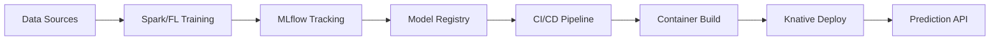
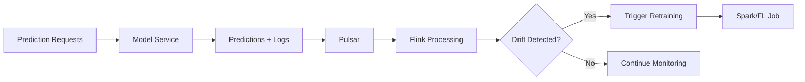

# MLOps and Model as a Service Implementation Plan

## Overview

This document outlines the implementation of a comprehensive MLOps infrastructure that integrates with platformQ's existing ML capabilities, providing end-to-end model lifecycle management from experimentation to production serving.

## Architecture Components

### 1. MLflow Integration

MLflow will serve as the central MLOps backbone, providing:
- **Experiment Tracking**: Log parameters, metrics, and artifacts
- **Model Registry**: Version control and staging for models
- **Model Serving**: Standardized model packaging

### 2. Model Training Infrastructure

#### Spark ML Integration
- Instrument existing Spark jobs (`asset_classifier.py`, `federated_learning.py`, etc.)
- Automatic logging of experiments to MLflow
- Model artifacts stored in MinIO

#### Federated Learning Service Enhancement
- MLflow integration for federated model tracking
- Privacy-preserving model versioning
- Aggregate model registry

### 3. Model Serving Layer

#### Functions Service Extension
- Deploy models as serverless functions via Knative
- Support for multiple model formats (Spark ML, PyTorch, TensorFlow)
- Auto-scaling based on prediction load

#### Model Serving Pipeline
```
MLflow Registry → CI/CD Pipeline → Container Build → Knative Deployment
```

### 4. Model Monitoring & Feedback Loop

#### Flink-based Monitoring
- Real-time prediction monitoring
- Data drift detection
- Model performance degradation alerts

#### Feedback Architecture
```
Predictions → Pulsar → Flink Processing → Drift Detection → Retraining Trigger
```

## Implementation Phases

### Phase 1: MLflow Infrastructure Setup

1. **Deploy MLflow Server**
   - PostgreSQL backend for metadata
   - MinIO for artifact storage
   - Integration with existing auth service

2. **Create MLOps Service**
   - API for model management
   - Integration with MLflow APIs
   - Multi-tenant model isolation

### Phase 2: Training Pipeline Integration

1. **Spark ML Enhancement**
   ```python
   # Auto-log experiments
   mlflow.spark.autolog()
   
   # Register models after training
   mlflow.spark.log_model(
       spark_model,
       "model",
       registered_model_name=f"{tenant_id}_asset_classifier"
   )
   ```

2. **Federated Learning Integration**
   - Log federated rounds as nested runs
   - Track participant metrics
   - Register aggregated models

### Phase 3: Model Serving Implementation

1. **Model Deployment Pipeline**
   ```yaml
   # Knative Service Template
   apiVersion: serving.knative.dev/v1
   kind: Service
   metadata:
     name: model-{model_name}-{version}
   spec:
     template:
       spec:
         containers:
         - image: platformq/mlflow-serving:{model_version}
           env:
           - name: MODEL_URI
             value: "models:/{model_name}/{version}"
   ```

2. **Functions Service Extension**
   - Model loading from MLflow
   - Prediction endpoint generation
   - Request/response logging

### Phase 4: Monitoring & Feedback

1. **Prediction Stream Processing**
   ```python
   # Flink job for monitoring
   class ModelMonitoringJob:
       def process_predictions(self, stream):
           # Calculate drift metrics
           # Detect anomalies
           # Trigger alerts
   ```

2. **Automated Retraining**
   - Drift threshold configuration
   - Automatic job triggering
   - A/B testing for new models

## API Design

### MLOps Service API

```python
# Model Management
POST   /api/v1/models/register
GET    /api/v1/models/{model_name}/versions
POST   /api/v1/models/{model_name}/promote
DELETE /api/v1/models/{model_name}/versions/{version}

# Deployment
POST   /api/v1/deployments/create
GET    /api/v1/deployments/{deployment_id}/status
PUT    /api/v1/deployments/{deployment_id}/scale
DELETE /api/v1/deployments/{deployment_id}

# Monitoring
GET    /api/v1/models/{model_name}/metrics
POST   /api/v1/models/{model_name}/drift-config
GET    /api/v1/alerts/model-drift
```

## Data Flow

### Training to Production Flow



### Monitoring Feedback Loop



## Security & Multi-tenancy

### Model Isolation
- Tenant-specific model namespaces
- RBAC for model access
- Encrypted model storage

### Prediction Security
- JWT-based authentication
- Rate limiting per tenant
- Audit logging

## Scalability Considerations

### Horizontal Scaling
- Multiple MLflow tracking servers
- Distributed model registry
- Auto-scaling prediction services

### Performance Optimization
- Model caching in prediction services
- Batch prediction support
- GPU acceleration for inference

## Monitoring & Observability

### Metrics to Track
- Model prediction latency
- Prediction throughput
- Model accuracy over time
- Data drift indicators
- Resource utilization

### Dashboards
- Model performance dashboard
- Drift detection alerts
- Resource usage visualization
- A/B testing results

## Integration Points

### Existing Services
- **Auth Service**: User authentication for MLOps APIs
- **Digital Asset Service**: Model artifact management
- **Workflow Service**: Orchestrate training pipelines
- **Notification Service**: Alerts for drift/degradation

### Data Infrastructure
- **Pulsar**: Event streaming for predictions
- **Flink**: Real-time stream processing
- **MinIO**: Model artifact storage
- **Ignite**: Model metadata caching

## Example Workflows

### 1. Model Training & Registration

```python
# In Spark ML job
with mlflow.start_run():
    # Log parameters
    mlflow.log_params(training_params)
    
    # Train model
    model = train_classifier(data)
    
    # Log metrics
    mlflow.log_metrics(evaluation_metrics)
    
    # Register model
    mlflow.spark.log_model(
        model,
        "model",
        registered_model_name="asset_classifier"
    )
```

### 2. Model Deployment

```python
# MLOps service handles deployment
client.deploy_model(
    model_name="asset_classifier",
    version="3",
    deployment_config={
        "replicas": 3,
        "cpu": "500m",
        "memory": "1Gi",
        "autoscaling": {
            "min": 2,
            "max": 10,
            "target_cpu": 80
        }
    }
)
```

### 3. Drift Detection

```python
# Flink job monitors predictions
def detect_drift(prediction_stream):
    baseline_distribution = load_baseline()
    current_window = prediction_stream.window(minutes=5)
    
    drift_score = calculate_drift(
        baseline_distribution,
        current_window
    )
    
    if drift_score > threshold:
        trigger_retraining_workflow()
```

## Performance Requirements

- Model deployment: < 2 minutes
- Prediction latency: < 100ms (p99)
- Drift detection delay: < 5 minutes
- Retraining trigger: < 1 minute after drift

## Compliance & Governance

- Model lineage tracking
- Prediction audit trail
- GDPR compliance for predictions
- Model explanation capabilities

## Future Enhancements

1. **AutoML Integration**
   - Automated hyperparameter tuning
   - Neural architecture search
   - Feature engineering automation

2. **Edge Deployment**
   - Model optimization for edge devices
   - Federated inference
   - Offline prediction capability

3. **Advanced Monitoring**
   - Concept drift detection
   - Adversarial input detection
   - Fairness monitoring

4. **Model Interpretability**
   - SHAP/LIME integration
   - Feature importance tracking
   - Prediction explanations 