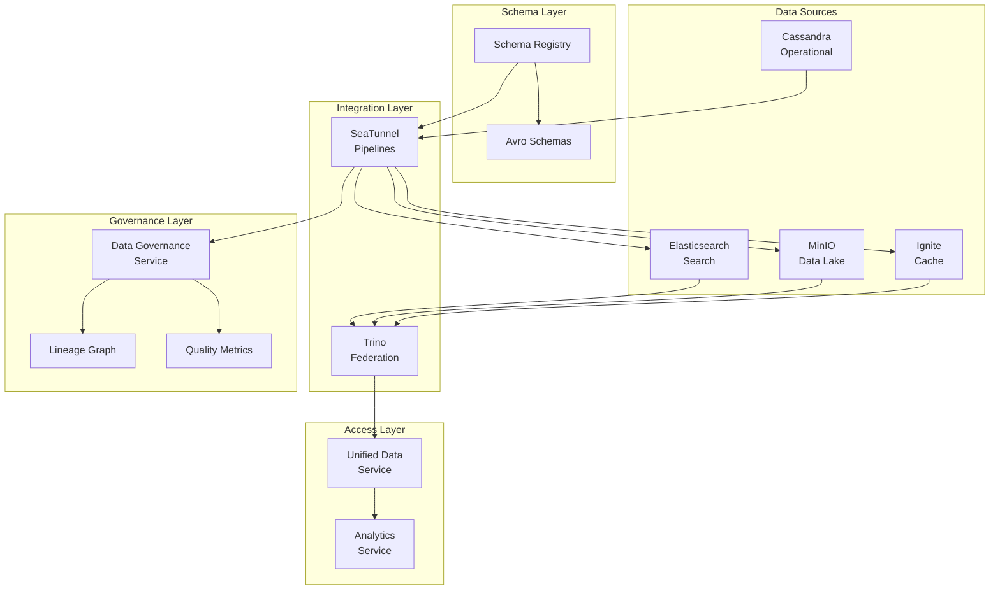

# Unified Data Mesh Architecture

## Overview

The Unified Data Mesh transforms platformQ's polyglot persistence architecture into a cohesive, federated data platform that enables seamless cross-domain analytics while maintaining the benefits of specialized storage systems. This implementation introduces standardized schema management, automated data synchronization, and unified query capabilities across all data stores.

## Architecture Components

### 1. Schema Registry Service

**Purpose**: Centralized schema management using Apache Avro for all data flowing through the platform.

**Key Features**:
- Confluent Schema Registry integration
- Schema versioning and evolution support
- Backward compatibility enforcement
- Automatic schema validation

**API Endpoints**:
- `POST /api/v1/schemas` - Register new schema
- `GET /api/v1/schemas/{subject}/versions` - List schema versions
- `POST /api/v1/schemas/compatibility/check` - Check compatibility
- `POST /api/v1/schemas/evolve` - Evolve existing schema

### 2. Unified Data Service

**Purpose**: Provides a single API for querying across all data stores using Trino as the federated query engine.

**Key Features**:
- Federated queries across Cassandra, Elasticsearch, MinIO, and Ignite
- Pre-defined federated views for common use cases
- Query lineage analysis
- Performance optimization

**Federated Views**:
- `unified_assets` - Consolidated view of digital assets across all stores
- `unified_user_activity` - User activity from multiple sources
- `data_quality_dashboard` - Real-time data quality metrics

**API Endpoints**:
- `POST /api/v1/query` - Execute federated query
- `GET /api/v1/federated-views` - List available views
- `GET /api/v1/data-sources` - List available data sources
- `GET /api/v1/schema/{catalog}/{schema}/{table}` - Get table schema

### 3. Enhanced SeaTunnel Service

**Purpose**: Automated data synchronization pipelines replacing custom ETL code.

**Core Pipelines**:

#### Digital Assets Sync
- **Type**: Batch (every 2 hours)
- **Flow**: Cassandra → Data Lake (MinIO) + Elasticsearch
- **Features**: Schema validation, partitioning by asset type and date

#### CAD Sessions Real-time
- **Type**: Streaming
- **Flow**: Pulsar → Ignite (cache) + Data Lake
- **Features**: Real-time updates, 24-hour cache expiry

#### User Activity Aggregation
- **Type**: Daily batch
- **Flow**: Multiple sources → Elasticsearch + Gold layer
- **Features**: Cross-source aggregation, engagement scoring

#### Data Quality Monitoring
- **Type**: Every 6 hours
- **Flow**: All sources → Quality metrics → Pulsar + Data Lake
- **Features**: Multi-dimensional quality checks, alerting

#### Schema Evolution Sync
- **Type**: Twice daily
- **Flow**: Schema Registry → Migration generator → Workflow service
- **Features**: Automatic schema change detection and propagation

**API Endpoints**:
- `GET /api/v1/pipelines/core` - List core pipelines
- `POST /api/v1/pipelines/core/{name}/deploy` - Deploy pipeline
- `POST /api/v1/pipelines/core/deploy-all` - Deploy all pipelines
- `GET /api/v1/pipelines/health` - Check pipeline health

### 4. Data Governance Service

**Purpose**: Manages data lineage, quality metrics, and governance policies.

**Key Features**:
- Lineage tracking with impact analysis
- Quality metric collection and trending
- Policy management (retention, access, quality, privacy)
- Data catalog with business metadata

**API Endpoints**:
- `POST /api/v1/assets` - Register data asset
- `GET /api/v1/lineage/{asset_id}` - Get asset lineage
- `POST /api/v1/quality/metrics` - Record quality metric
- `POST /api/v1/policies` - Create governance policy
- `GET /api/v1/governance/report` - Generate governance report

## Data Flow Architecture



## Implementation Phases

### Phase 1: Schema Registry and Avro Standardization ✓
- Deploy Confluent Schema Registry
- Create schema management service
- Update event publisher for schema registry integration
- Define core Avro schemas

### Phase 2: Enhance Trino Federation ✓
- Configure Trino connectors for all data stores
- Create unified data access service
- Implement federated views
- Add row-level security

### Phase 3: SeaTunnel Pipeline Migration ✓
- Create core synchronization pipelines
- Update SeaTunnel service with pipeline management
- Implement data quality checks
- Set up monitoring and alerting

### Phase 4: Data Governance Layer ✓
- Create data governance service
- Implement lineage tracking
- Add quality metric collection
- Create policy management

### Phase 5: Service Integration ✓
- Update analytics service to use unified data access
- Integrate governance APIs
- Create unified dashboards
- Implement cross-domain analytics

## Key Benefits

### 1. Unified Analytics
- Query across all data stores with SQL
- No need to understand underlying storage details
- Consistent data access patterns

### 2. Automated Synchronization
- Replace custom ETL with declarative pipelines
- Guaranteed data consistency
- Built-in error handling and retries

### 3. Schema Evolution
- Centralized schema management
- Automatic compatibility checking
- Controlled evolution across systems

### 4. Data Governance
- Complete lineage tracking
- Automated quality monitoring
- Policy enforcement
- Impact analysis for changes

### 5. Performance Optimization
- Intelligent caching with Ignite
- Query federation reduces data movement
- Partitioned storage for efficient queries

## Usage Examples

### 1. Cross-Domain Query
```sql
-- Query digital assets with quality metrics and user activity
SELECT 
    da.asset_name,
    da.asset_type,
    ua.engagement_score,
    dq.quality_score
FROM cassandra.platformq.digital_assets da
JOIN hive.gold.user_activity_summary ua ON da.owner_id = ua.user_id
JOIN elasticsearch.default.data_quality_latest dq ON da.asset_id = dq.asset_id
WHERE dq.quality_score > 0.9
  AND ua.engagement_score > 50
```

### 2. Deploy Core Pipeline
```bash
# Deploy digital asset synchronization pipeline
curl -X POST http://seatunnel-service:8000/api/v1/pipelines/core/digital_assets_sync/deploy \
  -H "Authorization: Bearer $TOKEN"

# Check pipeline health
curl http://seatunnel-service:8000/api/v1/pipelines/health
```

### 3. Register Data Asset
```bash
# Register a new data asset in the catalog
curl -X POST http://unified-data-service:8000/api/v1/assets \
  -H "Content-Type: application/json" \
  -d '{
    "asset_name": "Customer Orders",
    "asset_type": "table",
    "catalog": "cassandra",
    "schema": "platformq",
    "table": "orders",
    "owner": "sales-team",
    "tags": ["sales", "critical"]
  }'
```

### 4. Analyze Impact
```bash
# Get impact analysis for an asset
curl http://unified-data-service:8000/api/v1/lineage/impact/cassandra.platformq.orders
```

## Monitoring and Operations

### Pipeline Health Dashboard
- Overall pipeline status
- Failed job alerts
- Processing lag metrics
- Data freshness indicators

### Quality Metrics Dashboard
- Quality scores by layer
- Trend analysis
- Failing datasets
- SLA compliance

### Lineage Visualization
- Interactive lineage graph
- Impact radius visualization
- Critical path identification
- Dependency analysis

## Best Practices

### 1. Schema Design
- Use Avro for all event schemas
- Include version fields
- Set appropriate defaults for new fields
- Document field purposes

### 2. Pipeline Configuration
- Set appropriate parallelism
- Configure checkpointing
- Use incremental processing where possible
- Monitor resource usage

### 3. Query Optimization
- Use partitioned tables
- Leverage federated views
- Limit result sets
- Cache frequently accessed data

### 4. Governance
- Register all data assets
- Track lineage relationships
- Set quality thresholds
- Define retention policies

## Troubleshooting

### Common Issues

1. **Schema Evolution Conflicts**
   - Check compatibility mode
   - Review field changes
   - Use schema evolution API

2. **Pipeline Failures**
   - Check source connectivity
   - Verify schema compatibility
   - Review error logs

3. **Query Performance**
   - Analyze query plan
   - Check partition pruning
   - Consider materialized views

4. **Quality Degradation**
   - Review quality metrics
   - Check upstream changes
   - Validate transformation logic

## Future Enhancements

1. **Real-time Data Mesh**
   - Streaming SQL with Flink
   - Change data capture (CDC) for all sources
   - Real-time quality monitoring

2. **Advanced Governance**
   - Automated data classification
   - Privacy-preserving analytics
   - Compliance reporting

3. **Self-Service Analytics**
   - Natural language queries
   - Automated insight generation
   - Collaborative notebooks

4. **ML Integration**
   - Feature store integration
   - Model lineage tracking
   - Automated feature engineering 