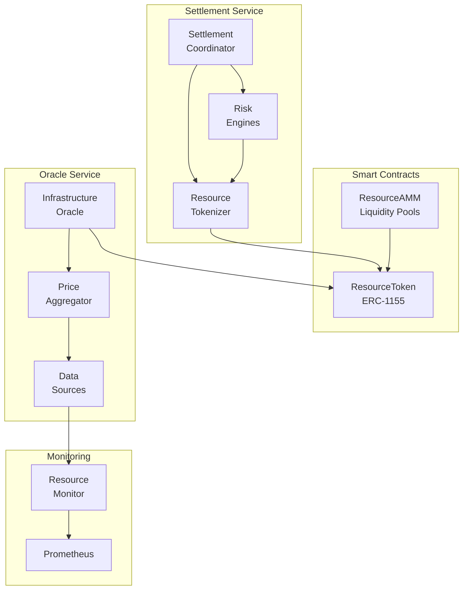

# Infrastructure DeFi Implementation - Phase 1

This document describes the implementation of Phase 1 of the Infrastructure DeFi Integration Plan for PlatformQ.

## Overview

Infrastructure DeFi transforms idle compute resources into liquid, tradeable assets through tokenization. This implementation provides the foundation for creating efficient resource markets, enabling risk management, and opening new revenue streams.

## Phase 1 Components Implemented

### 1. ResourceToken Smart Contract (ERC-1155)

**Location**: `services/verifiable-credential-service/app/contracts/defi/ResourceToken.sol`

The ResourceToken contract implements the ERC-1155 multi-token standard to tokenize different types of compute resources:

#### Features:
- **Multi-Resource Support**: CPU, GPU, Storage, Bandwidth, Memory tokens
- **Service Tiers**: Standard, Premium, Guaranteed quality levels
- **Time-Based Validity**: Resources have validity periods (start/end timestamps)
- **Regional Support**: Resources are region-specific (e.g., us-east-1)
- **SLA Integration**: Each token includes SLA hash for verification
- **Provider Management**: Register providers, track capacity, reputation scores
- **Slashing Mechanism**: Penalize providers for SLA violations

#### Key Functions:
- `mintResource()`: Mint new resource tokens when providers commit capacity
- `burnResource()`: Burn tokens upon resource consumption
- `slashResource()`: Slash tokens for SLA violations
- `registerProvider()`: Register new resource providers
- `setProviderCapacity()`: Set available capacity for providers
- `updatePrice()`: Oracle function to update resource prices

### 2. ResourceAMM Smart Contract

**Location**: `services/verifiable-credential-service/app/contracts/defi/ResourceAMM.sol`

The ResourceAMM provides automated market making for resource tokens with specialized features:

#### Features:
- **Time Decay Pricing**: Prices decay as resources approach expiry
- **Multi-Pool Support**: Separate pools for different resource/region/tier combinations
- **LP Token Management**: Liquidity providers receive LP tokens
- **Dynamic Fees**: Configurable trading fees per pool
- **Regional Arbitrage**: Enable cross-region resource trading

#### Key Functions:
- `createPool()`: Create new liquidity pool for resource tokens
- `addLiquidity()`: Provide liquidity to earn trading fees
- `removeLiquidity()`: Withdraw liquidity and earned fees
- `swap()`: Trade between resource tokens and quote tokens (USDC, ETH)
- `getAmountOut()`: Calculate output amounts for swaps

### 3. Settlement Coordinator Service Enhancement

**Location**: `services/ProvisioningServices/settlement-coordinator-service/`

Enhanced the existing settlement coordinator service to integrate with resource tokenization:

#### New Components:

##### ResourceTokenizer Module
**File**: `app/tokenization/resource_tokenizer.py`

Handles interaction with the ResourceToken smart contract:
- Mints tokens when settlements are created
- Burns tokens upon resource consumption
- Slashes tokens for SLA violations
- Manages provider registration and capacity

#### Enhanced Features:
- **Automatic Token Minting**: Mints resource tokens for new settlements
- **Risk-Based Slashing**: Automatically slashes tokens for high-risk settlements
- **Token Tracking**: Maintains mapping between settlements and token IDs
- **Blockchain Integration**: Uses Web3 for blockchain interactions
- **Gas Optimization**: Caches gas prices and nonces for efficiency

### 4. Infrastructure Oracle Service

**Location**: `services/blockchain/infrastructure-oracle-service/`

New service providing real-time pricing and metrics for infrastructure resources:

#### Components:

##### Main Application
**File**: `app/main.py`

FastAPI service with endpoints for:
- Resource pricing (current and historical)
- Resource metrics (utilization, capacity)
- Price volatility calculations
- Price forecasting
- Manual price updates

##### Data Aggregation
Aggregates pricing data from multiple sources:
- CloudKitty (historical costs)
- Platform monitoring (utilization)
- DeFi protocols (market prices)
- External providers (AWS, GCP spot prices)

#### API Endpoints:
- `GET /api/v1/price` - Get current resource prices
- `GET /api/v1/metrics/{resource_type}` - Get resource metrics
- `GET /api/v1/price/history` - Historical price data
- `GET /api/v1/volatility/{resource_type}` - Price volatility metrics
- `GET /api/v1/forecast/{resource_type}` - Price forecasts
- `POST /api/v1/price/update` - Manual price updates (admin)

### 5. Monitoring Integration

Enhanced the resource monitoring service to track tokenized resources:

#### Updates:
- Track token minting/burning events
- Monitor resource utilization for tokenized resources
- Detect SLA violations for slashing
- Publish metrics for oracle pricing

## Architecture Diagram



## Configuration

### Settlement Coordinator Service

Add these environment variables:

```bash
# Enable tokenization
ENABLE_TOKENIZATION=true

# Blockchain configuration
BLOCKCHAIN_CHAIN_ID=1
BLOCKCHAIN_RPC_URL=http://localhost:8545
RESOURCE_TOKEN_CONTRACT=0x...  # Deployed contract address
TOKENIZER_PRIVATE_KEY=0x...     # Private key for minting/burning
```

### Infrastructure Oracle Service

```bash
# Oracle configuration
RPC_URL=http://localhost:8545
ORACLE_CONTRACT_ADDRESS=0x...   # ResourceToken contract
ORACLE_PRIVATE_KEY=0x...        # Oracle private key

# Data sources
CLOUDKITTY_URL=http://cloudkitty:8889
PROMETHEUS_URL=http://prometheus:9090
MARKET_DATA_URL=http://market-data-service:8080
```

## Deployment Steps

### 1. Deploy Smart Contracts

```bash
# Compile contracts
cd services/verifiable-credential-service
npx hardhat compile

# Deploy to network
npx hardhat run scripts/deploy_infrastructure_defi.js --network <network>
```

### 2. Configure Services

Update service configurations with deployed contract addresses and private keys.

### 3. Start Services

```bash
# Start enhanced settlement coordinator
docker-compose -f docker-compose.settlement.yml up -d

# Start infrastructure oracle
docker-compose -f docker-compose.oracle.yml up -d
```

### 4. Initialize System

```bash
# Register providers
curl -X POST http://localhost:8092/api/v1/providers/register \
  -H "Content-Type: application/json" \
  -d '{
    "provider_address": "0x...",
    "initial_reputation": 500
  }'

# Set provider capacity
curl -X POST http://localhost:8092/api/v1/providers/capacity \
  -H "Content-Type: application/json" \
  -d '{
    "provider_address": "0x...",
    "resource_type": "cpu",
    "capacity": 10000
  }'
```

## Security Considerations

### Smart Contract Security
- Access control using OpenZeppelin's AccessControl
- Reentrancy protection on all external functions
- Pausable functionality for emergency stops
- Input validation and overflow protection

### Service Security
- Private keys stored in Vault
- TLS for all service communication
- Rate limiting on API endpoints
- JWT authentication for admin functions

### Risk Management
- Automatic slashing for SLA violations
- Escrow mechanisms for high-risk settlements
- Multi-source price aggregation to prevent manipulation
- Time-locked operations for critical functions

## Next Steps (Phase 2-4)

### Phase 2: Market Creation (Months 4-6)
- Deploy ResourceAMM pools for major resource types
- Implement infrastructure-backed lending
- Launch liquidity mining program
- Create cross-resource and regional pools

### Phase 3: Risk Management (Months 7-9)
- Unified risk engine deployment
- Extended insurance pool integration
- Automated claim processing
- Advanced risk analytics

### Phase 4: Advanced Features (Months 10-12)
- Flash resource provisioning
- Predictive scaling via market signals
- Cross-region arbitrage automation
- Mobile app integration

## Monitoring and Metrics

### Key Metrics to Track
- Total Value Locked (TVL) in resource tokens
- Daily trading volume across AMM pools
- Number of active providers and consumers
- SLA compliance rates and slashing events
- Price volatility by resource type
- Oracle update frequency and accuracy

### Dashboards
- Grafana dashboards for real-time metrics
- Smart contract events tracking
- Service health monitoring
- Risk assessment analytics

## API Examples

### Mint Resource Tokens
```json
POST /api/v1/settlements/process
{
  "trade_id": "trade-123",
  "buyer_id": "buyer-456",
  "seller_id": "seller-789",
  "provider_id": "provider-001",
  "resource_type": "gpu",
  "quantity": 100,
  "unit_price": 0.5,
  "total_value": 50,
  "trade_timestamp": "2024-01-01T00:00:00Z",
  "delivery_start": "2024-01-02T00:00:00Z",
  "delivery_end": "2024-01-03T00:00:00Z",
  "tokenize": true,
  "provider_wallet": "0x...",
  "sla_terms": {
    "uptime": 99.9,
    "latency": 50,
    "throughput": 1000
  }
}
```

### Get Resource Price
```json
GET /api/v1/price?resource_type=gpu&region=us-east-1&tier=premium&quantity=10&duration_hours=24

Response:
{
  "resource_type": "gpu",
  "region": "us-east-1", 
  "tier": "premium",
  "price_per_unit": "0.75",
  "total_price": "180.00",
  "currency": "USD",
  "confidence": 0.95,
  "sources": ["cloudkitty", "prometheus", "market"],
  "timestamp": "2024-01-01T12:00:00Z"
}
```

## Conclusion

Phase 1 successfully implements the foundation for Infrastructure DeFi on PlatformQ:

✅ Resource tokenization via ERC-1155 standard
✅ Settlement service integration with automatic minting/burning
✅ Risk-based token slashing for SLA enforcement  
✅ Real-time oracle for resource pricing
✅ AMM contracts for resource liquidity pools
✅ Enhanced monitoring for tokenized resources

This foundation enables efficient resource markets, improved capital efficiency, and new financial products built on top of infrastructure resources. 