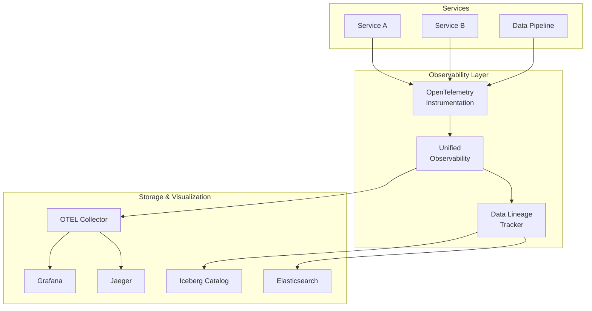

# Unified Observability & Lineage Guide

## Overview

PlatformQ's Unified Observability system integrates OpenTelemetry distributed tracing with Apache Iceberg metadata tracking to provide comprehensive observability and data lineage across all services.

## Architecture



## Quick Start

### 1. Basic Service Integration

```python
from fastapi import FastAPI
from platformq_shared.base_service import create_base_app
from platformq_shared.observability import trace_async, SpanType

# Service is automatically instrumented via create_base_app
app = create_base_app(
    service_name="my-service",
    # ... other params
)

# Add custom tracing to functions
@trace_async(span_type=SpanType.API_REQUEST)
async def process_request(data: dict):
    # Your logic here
    return result
```

### 2. Data Pipeline Instrumentation

```python
from platformq_shared.observability import DataPipelineTracer

async def run_etl_pipeline():
    async with DataPipelineTracer("sales_etl") as tracer:
        # Read phase
        sales_df = await tracer.trace_read(
            "raw.sales",
            spark.read.table,
            "raw.sales"
        )
        
        # Transform phase
        aggregated = await tracer.trace_transform(
            "aggregate_by_region",
            aggregate_sales,
            sales_df
        )
        
        # Write phase
        await tracer.trace_write(
            "analytics.regional_sales",
            aggregated.write.mode("overwrite").saveAsTable,
            "analytics.regional_sales"
        )
        
        # Record metadata
        tracer.set_row_count(aggregated.count())
        tracer.add_columns_written(["region", "total_sales", "avg_order_value"])
```

### 3. Iceberg Operation Tracking

```python
from platformq_shared.observability import get_observability

async def update_iceberg_table():
    obs = await get_observability()
    
    async with obs.trace_operation(
        "iceberg_update",
        SpanType.DATA_TRANSFORMATION
    ) as span:
        # Perform Iceberg operation
        table = catalog.load_table("warehouse.sales")
        table.add_files(new_data_files)
        
        # Track Iceberg metadata
        metadata = await obs.track_iceberg_operation(
            "warehouse.sales",
            "add_files",
            span
        )
        
        # Metadata includes snapshot_id, file_count, etc.
```

## Advanced Features

### 1. Custom Span Attributes

```python
from platformq_shared.observability import trace_async

@trace_async(
    operation_name="custom_processing",
    span_type=SpanType.DATA_TRANSFORMATION,
    track_args=True,  # Automatically track function arguments
    track_result=True  # Track return value
)
async def process_with_metadata(dataset_id: str, options: dict):
    # Span will include dataset_id and options as attributes
    result = await heavy_processing()
    return result  # Result type and size tracked
```

### 2. Measure Performance

```python
from platformq_shared.observability import measure_time, count_calls

@measure_time("ml_inference_duration")
@count_calls(labels={"model": "sentiment_analyzer"})
async def run_inference(text: str):
    # Automatically tracks duration and call count
    return model.predict(text)
```

### 3. Class Instrumentation

```python
from platformq_shared.observability import instrument_class

@instrument_class
class DataProcessor:
    # All public methods automatically traced
    async def load_data(self, path: str):
        return pd.read_parquet(path)
        
    async def transform(self, df: pd.DataFrame):
        return df.groupby("category").sum()
        
    async def save(self, df: pd.DataFrame, path: str):
        df.to_parquet(path)
```

### 4. Query Data Lineage

```python
obs = await get_observability()

# Find all operations that touched a specific table
lineage = await obs.query_lineage(
    table_name="warehouse.customers",
    start_time=datetime.utcnow() - timedelta(days=7),
    limit=100
)

# Get lineage for a specific dataset
dataset_lineage = await obs.query_lineage(
    dataset_id="sales_etl_20240115_120000",
    limit=50
)

# Results include source/target tables, transformations, row counts, etc.
```

## Configuration

### Environment Variables

```bash
# OpenTelemetry Configuration
OTEL_EXPORTER_OTLP_ENDPOINT=http://otel-collector:4317
OTEL_SERVICE_NAME=my-service
OTEL_TRACES_SAMPLER=traceidratio
OTEL_TRACES_SAMPLER_ARG=1.0  # 100% sampling

# Elasticsearch for Lineage
ELASTICSEARCH_URL=http://elasticsearch:9200

# Iceberg Catalog
ICEBERG_CATALOG_URI=thrift://hive-metastore:9083

# Jaeger UI
JAEGER_UI_URL=http://jaeger:16686
```

### Service Configuration

```python
from platformq_shared.observability import ObservabilityConfig

config = ObservabilityConfig(
    service_name="data-platform-service",
    otlp_endpoint="http://otel-collector:4317",
    enable_traces=True,
    enable_metrics=True,
    enable_lineage=True,
    trace_sample_rate=0.1,  # Sample 10% in production
    metrics_export_interval=60,
    lineage_retention_days=90
)
```

## Visualization

### 1. Jaeger UI

Access Jaeger at `http://localhost:16686` to:
- View distributed traces across services
- Analyze request flow and latency
- Debug errors with full stack traces
- Compare trace performance over time

### 2. Custom Dashboards

The system includes pre-built dashboards for:
- **Data Pipeline Overview**: Pipeline execution times, success rates
- **Iceberg Operations**: Table operations, snapshot history
- **Data Lineage Graph**: Visual representation of data flow
- **Performance Metrics**: P95/P99 latencies, throughput

### 3. Elasticsearch Queries

Query lineage data directly:

```json
GET platformq_data_lineage/_search
{
  "query": {
    "bool": {
      "must": [
        {"term": {"operation_type": "aggregation"}},
        {"range": {"timestamp": {"gte": "now-7d"}}}
      ]
    }
  },
  "aggs": {
    "by_service": {
      "terms": {"field": "service_name"}
    }
  }
}
```

## Best Practices

### 1. Span Naming

Use descriptive, hierarchical names:
- ✅ `user_service.create_user`
- ✅ `etl.sales.aggregate_by_region`
- ❌ `process_data`
- ❌ `step1`

### 2. Attribute Guidelines

Include relevant context without sensitive data:
- ✅ `user_id`, `dataset_name`, `table_name`
- ✅ `row_count`, `duration_ms`, `error_type`
- ❌ `password`, `ssn`, `credit_card`
- ❌ Full data payloads

### 3. Error Handling

Errors are automatically captured, but add context:

```python
async with obs.trace_operation("risky_operation") as span:
    try:
        result = await risky_call()
    except SpecificError as e:
        span.set_attribute("error.details", str(e))
        span.set_attribute("retry_count", retry_count)
        raise
```

### 4. Sampling Strategy

Production sampling recommendations:
- API requests: 1-10% sampling
- Background jobs: 100% sampling
- Error traces: Always sample
- Data pipelines: 100% for lineage

## Troubleshooting

### Missing Traces

1. Check OTEL Collector is running:
   ```bash
   curl http://otel-collector:13133/health
   ```

2. Verify service configuration:
   ```python
   obs = await get_observability()
   print(obs.config)
   ```

3. Check sampling rate:
   ```bash
   echo $OTEL_TRACES_SAMPLER_ARG
   ```

### Lineage Not Appearing

1. Ensure Elasticsearch is accessible:
   ```bash
   curl http://elasticsearch:9200/_cluster/health
   ```

2. Check index exists:
   ```bash
   curl http://elasticsearch:9200/platformq_data_lineage
   ```

3. Verify lineage is enabled:
   ```python
   assert obs.config.enable_lineage
   ```

### Performance Impact

Observability overhead is typically <1ms per span:
- Use sampling in high-volume services
- Batch span exports (default: 512 spans)
- Monitor collector memory usage

## Integration Examples

### Spark Integration

```python
from pyspark.sql import SparkSession
from platformq_shared.observability import DataPipelineTracer

spark = SparkSession.builder \
    .appName("ObservableETL") \
    .config("spark.sql.queryExecutionListeners", 
            "io.opentelemetry.spark.SparkQueryExecutionListener") \
    .getOrCreate()

async def run_spark_etl():
    async with DataPipelineTracer("spark_etl") as tracer:
        df = await tracer.trace_read(
            "hdfs://data/raw/events",
            spark.read.parquet,
            "hdfs://data/raw/events"
        )
        
        # Spark operations are automatically traced
        result = df.filter(df.event_type == "purchase") \
                  .groupBy("user_id") \
                  .count()
        
        await tracer.trace_write(
            "iceberg.analytics.user_purchases",
            result.writeTo,
            "iceberg.analytics.user_purchases"
        )
```

### Flink Integration

```python
from pyflink.datastream import StreamExecutionEnvironment
from platformq_shared.observability import trace_async

env = StreamExecutionEnvironment.get_execution_environment()

@trace_async(span_type=SpanType.DATA_PIPELINE)
async def process_stream(stream):
    return stream \
        .filter(lambda x: x.value > threshold) \
        .map(transform_function) \
        .add_sink(kafka_sink)
```

### ML Pipeline Integration

```python
from platformq_shared.observability import trace_async, SpanType

@trace_async(span_type=SpanType.ML_TRAINING)
async def train_model(dataset_path: str, hyperparams: dict):
    # Load data
    data = await load_dataset(dataset_path)
    
    # Training automatically traced
    model = await train(data, hyperparams)
    
    # Metrics tracked
    return {
        "model_id": model.id,
        "accuracy": model.evaluate(),
        "training_time": model.training_duration
    }
```

## Conclusion

The Unified Observability system provides comprehensive visibility into all aspects of PlatformQ operations, from API requests to complex data pipelines. By integrating OpenTelemetry with Iceberg metadata, we achieve:

- **Complete Traceability**: Every operation is tracked end-to-end
- **Data Lineage**: Full visibility into data transformations
- **Performance Insights**: Identify bottlenecks and optimize
- **Error Debugging**: Quickly diagnose and fix issues
- **Compliance**: Audit trail for regulatory requirements

For questions or issues, please refer to the [troubleshooting guide](#troubleshooting) or contact the platform team. 