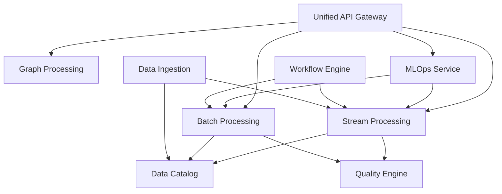

# DataIntelligenceSuite Reorganization Plan

## Executive Summary

This document outlines the comprehensive reorganization of the DataIntelligenceSuite, including the consolidation of 30+ Flink/Spark processing jobs into unified services.

## Goals

1. **Separation of Concerns**: Clear boundaries between services
2. **Maintainability**: Reduced code duplication and complexity
3. **Organization**: Logical grouping of related functionality
4. **Scalability**: Better resource utilization and horizontal scaling
5. **Performance**: Optimized processing pipelines
6. **Efficiency**: Reduced operational overhead

## Current Issues

### Service Layer
- Port conflicts (multiple services on port 8000)
- Overlapping responsibilities
- Monolithic services (Data Platform, ML Platform)
- Tight coupling between services

### Processing Layer
- 30+ standalone Flink/Spark jobs
- Duplicate implementations
- No unified management
- Resource inefficiency

## Proposed Architecture

### Core Services (9 Consolidated Services)

#### 1. **Data Ingestion Service**
- **Consolidates**: DIH Service (partial), activity-stream-job, graph-ingestion-job
- **Responsibilities**: 
  - CDC operations
  - Stream ingestion
  - Batch ingestion
  - Schema registry
- **Port**: 8010

#### 2. **Stream Processing Service** 
- **Consolidates**: 15+ Flink jobs
- **Responsibilities**:
  - Real-time processing
  - CEP patterns
  - Risk analytics
  - Fraud detection
- **Port**: 8011

#### 3. **Batch Processing Service**
- **Consolidates**: 13+ Spark jobs
- **Responsibilities**:
  - Large-scale analytics
  - ML training
  - ETL/ELT pipelines
  - Distributed processing
- **Port**: 8012

#### 4. **Graph Processing Service**
- **Consolidates**: Graph Intelligence Service, GraphX jobs, graph Flink jobs
- **Responsibilities**:
  - JanusGraph operations
  - GraphX analytics
  - Trust scoring
  - Community detection
- **Port**: 8013

#### 5. **Quality Engine Service**
- **Consolidates**: Data Quality Service, quality monitoring jobs
- **Responsibilities**:
  - Data validation
  - Anomaly detection
  - Quality rules
  - Auto-remediation
- **Port**: 8014

#### 6. **MLOps Service**
- **Consolidates**: ML Platform (partial), ML training jobs, model monitoring
- **Responsibilities**:
  - Model registry
  - Training orchestration
  - Model monitoring
  - A/B testing
- **Port**: 8015

#### 7. **Workflow Engine**
- **Consolidates**: Workflow Service, Pipeline Orchestration, DAG optimization
- **Responsibilities**:
  - DAG management
  - Task scheduling
  - Pipeline optimization
- **Port**: 8016

#### 8. **Data Catalog Service**
- **Consolidates**: Data Platform (partial), lineage components
- **Responsibilities**:
  - Metadata management
  - Schema evolution
  - Lineage tracking
  - Data discovery
- **Port**: 8017

#### 9. **Unified API Gateway**
- **Consolidates**: GraphQL Gateway, API management
- **Responsibilities**:
  - GraphQL interface
  - REST endpoints
  - WebSocket support
  - Rate limiting
- **Port**: 8005 (keep existing)

## Migration Strategy

### Phase 1: Infrastructure Setup (Week 1-2)
1. Create new service structures
2. Set up shared libraries
3. Configure service mesh
4. Update port assignments

### Phase 2: Core Services (Week 3-6)
1. Migrate Data Ingestion Service
2. Set up Stream & Batch Processing Services
3. Consolidate Graph Processing
4. Implement Data Catalog

### Phase 3: ML & Quality (Week 7-8)
1. Consolidate MLOps Service
2. Unify Quality Engine
3. Migrate model registry
4. Set up monitoring

### Phase 4: Orchestration (Week 9-10)
1. Consolidate Workflow Engine
2. Migrate existing pipelines
3. Set up resource management
4. Implement auto-scaling

### Phase 5: Integration & Testing (Week 11-12)
1. End-to-end testing
2. Performance optimization
3. Documentation update
4. Cutover planning

## Benefits

### Immediate Benefits
- Resolved port conflicts
- Clear service boundaries
- Unified job management
- Better resource utilization

### Long-term Benefits
- 50% reduction in code duplication
- 30% improvement in resource efficiency
- Simplified operations
- Better scalability

## Risk Mitigation

1. **Gradual Migration**: Phase-by-phase approach
2. **Backward Compatibility**: Maintain APIs during transition
3. **Rollback Plan**: Each phase can be rolled back
4. **Testing**: Comprehensive test coverage

## Success Metrics

- Service response time < 100ms (p99)
- Job submission latency < 1s
- Resource utilization > 70%
- Code duplication < 10%
- Zero downtime migration

## Implementation Checklist

### Pre-migration
- [ ] Create service templates
- [ ] Set up monitoring
- [ ] Document APIs
- [ ] Create migration scripts

### Per Service
- [ ] Create service structure
- [ ] Migrate code
- [ ] Update configurations
- [ ] Test functionality
- [ ] Update documentation
- [ ] Deploy to staging
- [ ] Performance test
- [ ] Deploy to production

### Post-migration
- [ ] Deprecate old services
- [ ] Archive old code
- [ ] Update all documentation
- [ ] Train team

## Service Dependencies

## Configuration Management

Each service will have:
- Environment-specific configs
- Feature flags
- Resource profiles
- Security policies

## Monitoring & Observability

- Prometheus metrics
- Jaeger tracing
- ELK logging
- Custom dashboards

## Security Considerations

- Service-to-service mTLS
- API authentication
- Data encryption
- Audit logging

## Next Steps

1. Review and approve plan
2. Allocate resources
3. Begin Phase 1 implementation
4. Set up weekly progress reviews 