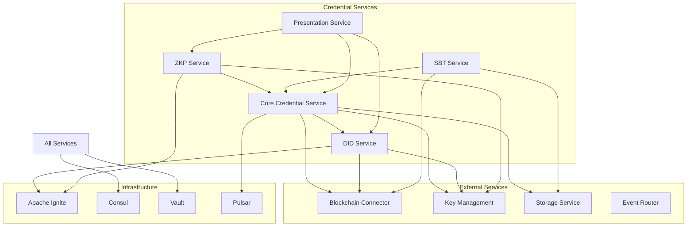

# Credential Services

This directory contains the microservices that implement PlatformQ's verifiable credential infrastructure. The services are designed to work together to provide a complete, standards-compliant, and privacy-preserving credential ecosystem.

## Architecture Overview



## Services

### 1. Core Credential Service (Port: 8050)
The central service for W3C Verifiable Credential operations:
- Issues verifiable credentials with various proof types
- Verifies credential signatures and validity
- Manages credential lifecycle (issuance, revocation, expiry)
- Handles credential storage and retrieval
- Publishes credential events for downstream processing

### 2. DID Service (Port: 8051)
Manages Decentralized Identifiers (DIDs):
- Creates DIDs using multiple methods (key, web, platformq, ethr)
- Resolves DIDs to DID documents
- Manages DID document updates and key rotation
- Caches DID documents for performance
- Supports DID authentication and verification

### 3. ZKP Service (Port: 8052)
Handles Zero-Knowledge Proof operations:
- Generates BBS+ signatures for selective disclosure
- Creates range proofs and predicate proofs
- Manages distributed proof generation using Apache Ignite
- Caches frequently used proofs
- Provides batch proof operations

### 4. SBT Service (Port: 8053)
Manages SoulBound Tokens (non-transferable NFTs):
- Mints SBTs linked to verifiable credentials
- Handles multi-chain SBT deployment
- Manages SBT revocation and recovery
- Provides cross-chain bridging for SBTs
- Integrates with smart contracts

### 5. Presentation Service (Port: 8054)
Orchestrates verifiable presentations:
- Creates presentations from multiple credentials
- Handles selective disclosure requests
- Manages presentation sessions
- Provides QR code generation for mobile
- Supports presentation templates

## Integration Patterns

### Event-Driven Architecture
All services publish events to Apache Pulsar topics:
- `credential-events`: Issuance, revocation, verification
- `did-events`: DID creation, updates, deactivation
- `zkp-events`: Proof generation, verification
- `sbt-events`: Minting, transfers, revocation
- `presentation-events`: Creation, submission, verification

### Service Mesh
Services use Consul Connect for:
- Service discovery
- Health checking
- Configuration management
- Secure service-to-service communication
- Traffic management

### Shared Infrastructure

#### Apache Ignite
- Distributed caching for credentials, DIDs, and proofs
- Compute grid for ZKP generation
- Session affinity for stateful operations

#### HashiCorp Vault
- Secure key storage
- Dynamic secrets
- Encryption as a service
- Certificate management

#### Consul
- Service registration and discovery
- Health monitoring
- Dynamic configuration
- Access control policies

## Common Workflows

### 1. Credential Issuance with SBT
```
1. Client → Core Credential Service: Issue credential
2. Core → DID Service: Resolve issuer DID
3. Core → Key Management: Sign credential
4. Core → Storage: Store credential
5. Core → Event Router: Publish issued event
6. SBT Service → (via event): Mint SBT
7. SBT → Blockchain Connector: Deploy on-chain
```

### 2. Selective Disclosure Presentation
```
1. Verifier → Presentation Service: Request presentation
2. Holder → Core Credential: Fetch credentials
3. Holder → ZKP Service: Generate selective disclosure proof
4. Holder → Presentation Service: Submit presentation
5. Presentation → DID Service: Resolve DIDs
6. Presentation → Core Credential: Verify credentials
7. Presentation → Verifier: Return verification result
```

### 3. Cross-Chain Credential Verification
```
1. Verifier → Core Credential: Verify credential
2. Core → DID Service: Resolve DIDs
3. Core → SBT Service: Check on-chain status
4. SBT → Blockchain Connector: Query multiple chains
5. Core → ZKP Service: Verify any ZK proofs
6. Core → Verifier: Return comprehensive result
```

## Security Model

### Zero-Trust Architecture
- mTLS between all services
- JWT tokens for API authentication
- Fine-grained RBAC policies
- Audit logging for all operations

### Privacy by Design
- Minimal data exposure
- Selective disclosure by default
- Unlinkable presentations
- Encrypted storage

### Key Management
- Hardware security module integration
- Key rotation policies
- Secure key derivation
- Threshold signing

## Performance Optimization

### Caching Strategy
- L1: In-memory service caches
- L2: Apache Ignite distributed cache
- L3: Database with indexes

### Asynchronous Processing
- Event-driven workflows
- Non-blocking I/O
- Worker pools for CPU-intensive tasks

### Horizontal Scaling
- Stateless service design
- Load balancing via Consul
- Auto-scaling based on metrics

## Development

### Local Development
Each service can be run independently:
```bash
cd services/credential/{service-name}
pip install -r requirements.txt
uvicorn app.main:app --reload
```

### Docker Compose
Run all services together:
```bash
docker-compose -f docker-compose.credential.yml up
```

### Testing
```bash
# Unit tests
pytest tests/unit

# Integration tests
pytest tests/integration

# End-to-end tests
pytest tests/e2e
```

## Monitoring

### Health Checks
- `/health` - Service health status
- `/metrics` - Prometheus metrics
- `/ready` - Readiness probe

### Dashboards
- Service performance metrics
- Credential issuance statistics
- Verification success rates
- Error tracking and alerting

## Migration from Monolith

The original `verifiable-credential-service` has been decomposed into these microservices. To migrate:

1. Update API calls to use new service endpoints
2. Migrate credential data using provided scripts
3. Update event consumers for new topic structure
4. Reconfigure authentication for service mesh

## Future Enhancements

- **Federated Credential Networks**: Cross-organization credential sharing
- **Advanced Privacy**: Homomorphic encryption for credentials
- **AI Integration**: Automated credential verification workflows
- **Mobile SDK**: Native mobile credential wallet integration
- **Compliance Modules**: GDPR, KYC/AML automated compliance 